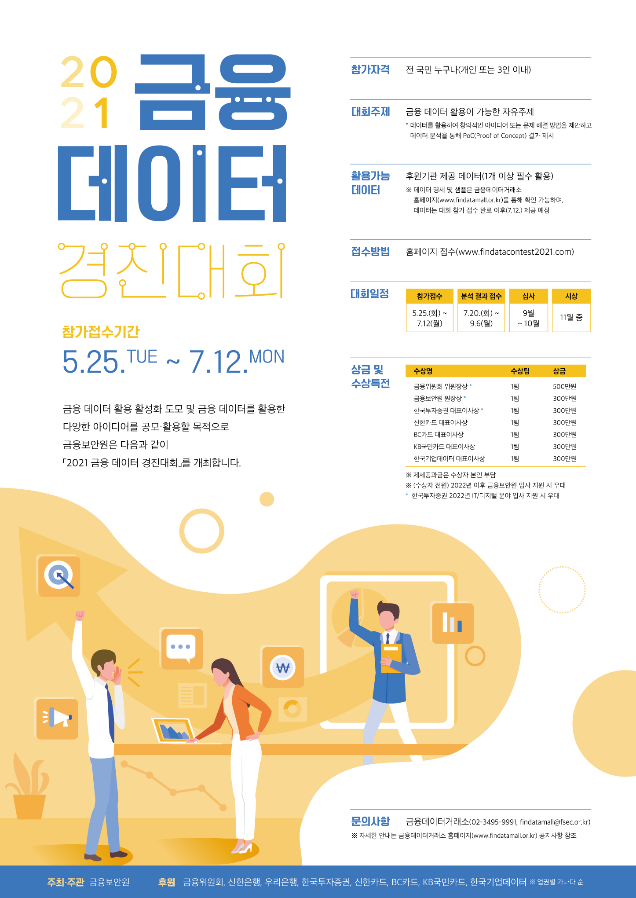

# 2021 금융 데이터 경진대회

## 1. 대회 기간

- 접수 : ~ 2021.07.12
- 결과물 제출 : ~2021.09.06(월)

## 2. 관련 링크 및 안내 내용물

- [대회 신청 링크](https://www.findatacontest2021.com/index.php)
- [샘플 데이터 링크](https://www.findatamall.or.kr/fsec/dataProd/generalDataProd.do?cmnx=44&sCharge=charge&sFree=free&sNego=nego&searchType=00&sKeyword=2021%EA%B8%88%EC%9C%B5%EB%8D%B0%EC%9D%B4%ED%84%B0%EA%B2%BD%EC%A7%84%EB%8C%80%ED%9A%8C&sTaxonomy=200&sOrderByType=orderByDate)
- [금융데이터 거래소](https://www.findatamall.or.kr/fsec/main/main.do?cmnx=1)
- [공공데이터 포털](https://www.data.go.kr/)

## 3. 선정 주제

- 미정 (6월 4째주에 팀 회의 이후 주제 및 데이터 가공 방향 결정)

## 4. 결과물 도출 일정

- 6월 4째주 : 팀 주제 선정 및 금융 데이터 대회 접수
- 7월 1째주 : 환경 설정 및 가공 방향 MD 작성, 사용할 ML 알고리즘 지정 (문서 제작 등)
- 7월 2째주 ~ 8월 중순 : 결과물 제작
- 8월 4째주 ~ 9월 5일 : 결과물 리뷰
- 9월 6일 : 제출

## 5. 기타 : 대회 포스터

